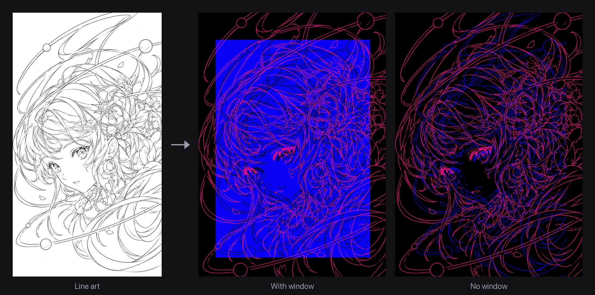
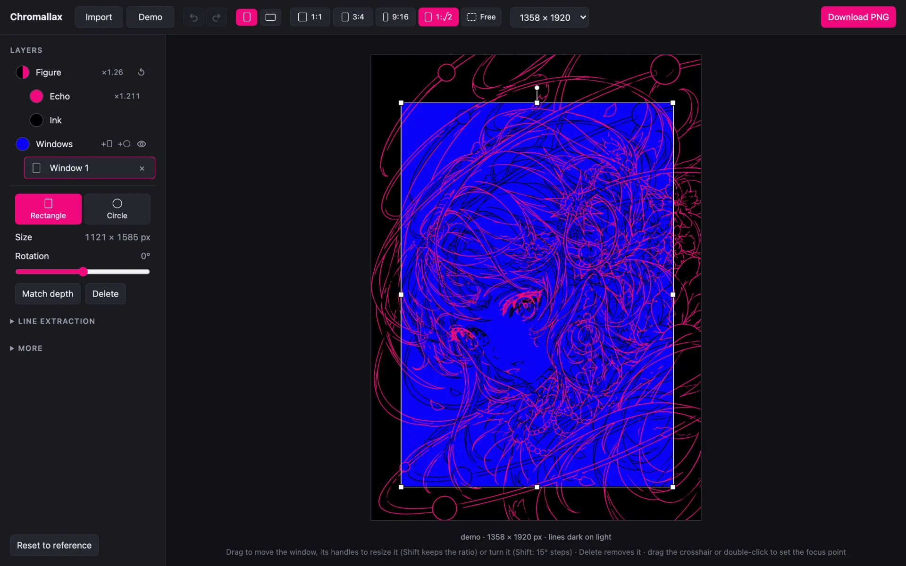
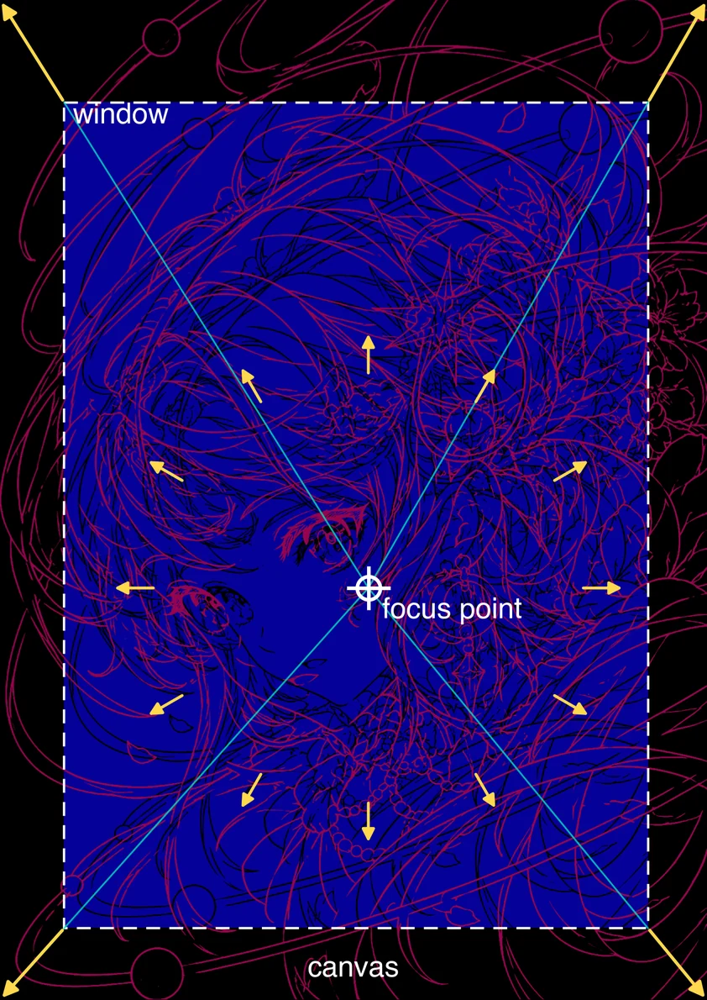

# Chromallax

Chroma + parallax: turns clean line art into a dual-line fake-3D illustration. A black copy of the drawing sits on a flat cobalt window, and a larger magenta copy floats in front of it and spills past the window's edges. Without the window, the smaller copy is drawn in blue straight on the black background. You can also cut several windows, rectangles and circles of any size, ratio and angle.



## Getting started

Chromallax runs in your web browser. A tiny local server, included in the project, serves it to the browser. All you need is Node.js; there is nothing else to install.

### 1. Install Node.js (once)

Download the **LTS** version from [nodejs.org](https://nodejs.org) and install it. Any version from 20 up works. To check, open a terminal and run:

```bash
node -v
```

It should print a version such as `v22.11.0`.

> **Which terminal?** On macOS, use the **Terminal** app (Applications → Utilities). On Windows, use **PowerShell** from the Start menu.

### 2. Get the code

Clone the repository with git, or use GitHub's **Code → Download ZIP** and unzip it anywhere.

### 3. Start the app

Open a terminal **in the project folder**:

- **macOS**: type `cd ` (with a space), drag the project folder onto the Terminal window, and press Enter.
- **Windows**: open the folder in File Explorer, click the address bar, type `powershell` and press Enter.

Then run:

```bash
npm run dev
```

It prints a line like `Serving … at http://localhost:5173`. Open that address in Chrome, Safari, Firefox or Edge. There's no `npm install` step, because the project has no dependencies.

> Leave the terminal window open while you use the app. The terminal is the server.

### 4. Use it

1. Click **Import** to load your line art, or drag an image onto the page or paste one. The **Demo** button loads a sample drawing. See [Choosing line art](#choosing-line-art) for what works best.
2. Choose the canvas in the toolbar: portrait or landscape, a ratio, and a size.
3. Adjust the picture. Drag to move and scroll to resize; the **Layers** list on the left picks what these gestures act on. See [Controls](#controls).
4. Click **Download PNG**.

### 5. Stop the app

Go back to the terminal and press **Ctrl + C**, on macOS too. On Windows, answer `Y` if it asks "Terminate batch job?". Closing the browser tab does **not** stop the server. To use the app again later, repeat step 3.

### Troubleshooting

- **"Port 5173 is in use"**: another copy is still running, perhaps in another terminal window. The server moves to the next free port and prints that address; open that one, or stop the other copy with Ctrl + C.
- **The page opens but stays on "Loading…"**, for example after double-clicking `index.html`: browsers won't run the app from a `file://` address. Start it with `npm run dev` and open the `http://localhost:…` address it prints.
- **`npm: command not found`** (or "not recognized"): Node.js isn't installed, or the terminal was opened before installing it. Install Node.js, then open a new terminal.

For developers: `npm test` runs the unit tests. No install is needed for those either.

## How it works



Two copies of the same drawing sit at two depths:

- The **Echo** (magenta) is the line art as placed on the canvas.
- The **Ink** (black) is the same art shrunk by the **depth** (about 1.21) toward a **focus point**.
- The **Window** (blue) is the whole canvas shrunk the same way, so the ink sits on it like a picture on a wall.

The window is optional, as the image at the top shows. Hide the windows, or delete them all, and the ink turns blue and sits straight on the black background, so only the lines float at two depths.

There can also be more windows: rectangles and circles of any size, placed anywhere on the canvas, and rectangles can be turned. The ink shows through all of them, as if they were holes cut in one sheet.



In the diagram, the cyan lines run from the focus point through the window's corners to the canvas corners. The window is the canvas scaled toward the focus point.

The yellow arrows show where the echo sits relative to the ink. The two layers meet exactly at the focus point, and the gap between them grows steadily towards the edges. That is how an object looks as it comes closer to you, so the echo reads as a nearer copy of the drawing, lifting out of the window.

The magenta-against-blue colours add to the depth: many people see saturated red as nearer than blue.

Put the focus point on the feature that should stay sharp, usually an eye.

<br clear="right">

## Controls

- **Toolbar**
  - **Import** an image, or load the **Demo**, which opens filling the canvas.
  - Choose portrait or landscape, then a ratio. The labels follow the orientation: 3:4 in portrait, 4:3 in landscape. **Free** lets you type an exact width × height.
  - Pick a size from the menu, which lists pixel dimensions (long edge 1080–3840 px). Then **Download PNG**.
- **Layers**: a tree of **Figure** (with **Echo** and **Ink** under it) and **Windows** (with a row per window). The selected row is what the gestures on the picture act on.
  - Drag, or use the arrow keys (Shift: 10 px), to move it.
  - Scroll, pinch or press +/- to resize it. The Figure zooms around the pointer. Echo, Ink and all windows together resize around the focus point, so echo and ink stay aligned there.
  - Resizing Echo or Ink changes the depth, shown on the Echo row.
  - A moved layer shows ↺, which resets its position. The colour swatches set each layer's colour.
- **Windows**: the ink shows only inside them. The Windows row adds a rectangle or a circle (**+**) and hides or shows all windows (the eye). With the Windows row selected, a drag moves all windows and scrolling resizes them.
  - Click a window on the picture, or its row, to select it. Drag it to move it, and drag its handles to resize it, as in a slide editor: corners change both sides, edges one side. Hold Shift to keep the ratio, and Alt (Option on a Mac) to keep the centre. Drag the round knob above it to turn it (Shift: 15° steps). Scrolling resizes it around its own centre.
  - Click beside the windows to deselect; a drag there then moves all of them. Delete removes the selected window, and so does the × on its row.
  - Without any window, nothing is filled or clipped. Black ink would vanish on the black background, so it takes the window colour, and turns black again when a window comes back.
- **Selected layer's properties**, below the tree
  - **Figure**: line width. By default the ink's strokes shrink with the ink; **Same width in echo and ink** thickens them back. **Fill canvas** scales the figure to cover the canvas. The Figure row's ↺ brings back the whole figure, centred.
  - **A window**: rectangle or circle, its size in pixels, and its rotation. **Match depth** turns it into the reference window: the canvas shrunk to 1 ÷ depth about the focus point. A window keeps its shape when you change the canvas ratio; only a window made with Match depth follows the canvas.
- **Focus point**: drag the crosshair, or double-click the picture, to put it on the feature that should stay locked. The crosshair appears while the pointer is over the picture.
- **Line extraction** (closed by default): polarity, threshold and softness, for images that don't come out clean.
- **More** (closed by default): exact values for the figure's zoom and position and for the focus point.

## Choosing line art

The effect relies on reading the two copies as the same strokes at two depths, so the input matters:

- Thin lines of even width work best. Small fills such as pupils are fine.
- Large solid fills and heavy or strongly pressure-varying strokes flatten the depth. The status line says when more than 15 % of the ink is fills or heavy strokes.
- Without a window, hatching and fills turn into areas of colour instead, which can work well. The status line doesn't warn then.
- Clean backgrounds with no shading or texture are best. Any grey that crosses the threshold becomes line.
- Images with transparency work too: whatever is opaque counts as line.

## Code

| Path | Role |
| --- | --- |
| `src/app.js` | UI and staged re-rendering |
| `src/config.js` | Defaults |
| `src/geometry.js` | Pure layout math: canvas presets, placement, depth, focus point, windows and their handles |
| `src/preprocess.js` | Pure pixel ops: line mask, stroke distance field, stroke statistics, line width |
| `src/render.js` | Canvas compositing |
| `tests/` | `node:test` unit tests for the pure modules |
| `scripts/serve.mjs` | The local development server |
| `assets/demo.webp` | Demo line art (AI-generated) |
| `docs/images/` | Images for this README |
