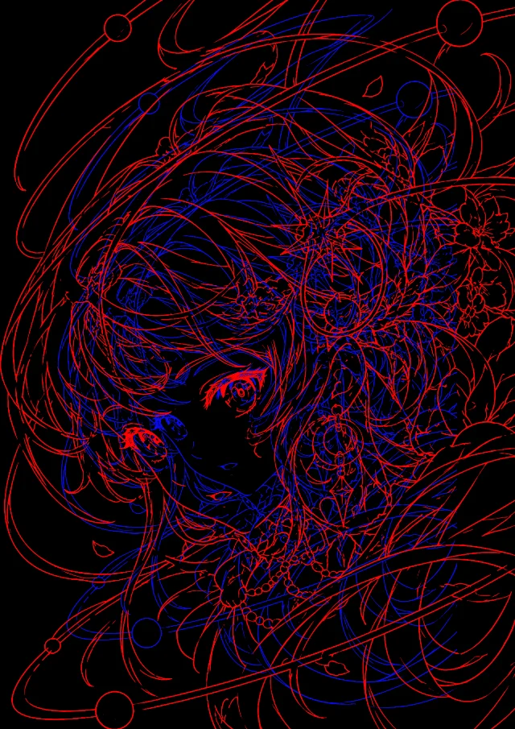

# Chromallax

English | [简体中文](README.zh-CN.md)

**Line art at two depths.** Chromallax turns a drawing into a fake-3D picture. A small dark copy sits on a flat blue window, and a larger magenta copy floats in front of it, spilling past the window's edges.


It runs in your browser, with nothing to install beyond Node.js, and saves PNG, JPEG, WebP or a looping GIF.

<table>
  <tr>
    <td></td>
    <td></td>
    <td></td>
  </tr>
  <tr>
    <td align="center">Wiggle, saved as a GIF</td>
    <td align="center">Windows of any shape</td>
    <td align="center">Red and blue, no window</td>
  </tr>
</table>

## Quick start

You need [Node.js](https://nodejs.org) 20 or later. In the project folder, run:

```bash
npm run dev
```

Then open the address it prints, usually http://localhost:5173. There is no `npm install` and no build step.

<details>
<summary><b>New to the terminal? Step by step</b></summary>

1. **Install Node.js** once: download the LTS version from [nodejs.org](https://nodejs.org). To check it worked, open a terminal and run `node -v`; it should print a version such as `v22.11.0`. On macOS the terminal is the **Terminal** app (Applications → Utilities); on Windows, use **PowerShell** from the Start menu.
2. **Get the code**: on GitHub, click **Code → Download ZIP** and unzip it anywhere, or clone the repository with git.
3. **Open a terminal in the project folder.**
   - macOS: type `cd ` (with a space), drag the folder onto the Terminal window, and press Enter.
   - Windows: open the folder in File Explorer, click the address bar, type `powershell` and press Enter.
4. **Start the app** with `npm run dev`, and open the `http://localhost:…` address it prints in Chrome, Safari, Firefox or Edge. Keep the terminal open while you work: it is the server.
5. **Stop it** with **Ctrl + C** in the terminal, on macOS too. Closing the browser tab doesn't stop it.

If something goes wrong:

- *Port 5173 is in use*: another copy is still running. The server picks the next free port and prints it; open that one.
- *The page stays on "Loading…"*: it was opened as a file (for example by double-clicking `index.html`). Start it with `npm run dev` and use the address it prints.
- *`npm` is not found*: Node.js isn't installed yet, or the terminal was opened before installing it. Install it and open a new terminal.

</details>

## How it works


Two copies of the same drawing sit at two depths. The **ink** is the drawing shrunk toward a **focus point**. The **echo**, in magenta, is the full-size drawing, so it meets the ink at the focus point and drifts further out towards the edges, which is how something nearer to you looks. The blue **window** is the canvas shrunk the same way, so the ink hangs in it like a picture on a wall.

The colours help as well: on a dark background, most people see red in front of blue.

Put the focus point on whatever should stay locked, usually an eye.

<br clear="right">

## Using it


Load a drawing with **Import**, by dropping it on the page, or by pasting it. **Demo** loads a sample. Choose the canvas shape and size in the toolbar. Then:

- **Layers** pick what you move on the picture: the whole figure, the echo, the ink or the windows. Drag to move, and scroll or pinch to resize.
- **Windows** are optional. Add rectangles and circles, and resize and turn them by their handles, as in a slide editor. The eye hides them all, which leaves lines on black.
- **Depth** is the number on the Echo row. Drag it sideways, or click it and type.
- **Colours** has palettes that put the redder colour in front, a Custom slot for your own colours, and a swap for anyone who sees it the other way round.
- **Motion** plays the picture as a wigglegram: stepping between a few views makes the two layers read as near and far.
- **Export** saves PNG, JPEG or WebP, or the motion as a GIF. In Chrome and Edge you choose the name and folder.

Undo and redo work as usual, and the app remembers your canvas, colours and windows for next time.

<details>
<summary><b>Mouse and keyboard</b></summary>

| Do this | To |
| --- | --- |
| Drag, or arrow keys (Shift: 10 px) | Move the selected layer |
| Scroll, pinch, or + / − | Resize it |
| Drag the crosshair, or double-click | Move the focus point |
| Shift while dragging a window's handle | Keep its ratio |
| Alt (Option) while dragging a window's handle | Keep its centre |
| Shift while turning a window | Turn in 15° steps |
| Delete or Backspace | Remove the selected window |
| Esc | Deselect the window |
| ⌘Z / ⇧⌘Z (Ctrl+Z / Ctrl+Y) | Undo / redo |

</details>

## Getting a good result

- **Line art**: thin lines of even width give the clearest depth. Large solid fills and heavy strokes flatten it, and the status line points that out.
- **Without a window**, dense hatching and fills turn into areas of colour, which suits heavily shaded drawings.
- **Scans and photos of drawings**: open **Line extraction**, turn on *Even out the paper's light*, press *Auto*, then *Remove specks*.

  

- **Photos** (experimental): switch **Line extraction** to *Photo*. It works best with a plain or blurred background, as in a phone's portrait mode. Every edge becomes a line, so a busy background gives busy lines.

  

## Development

`npm test` runs the unit tests with Node's built-in test runner. The app is plain HTML, CSS and ES modules, with no dependencies and no build.

<details>
<summary><b>Where things are</b></summary>

| Path | Role |
| --- | --- |
| `src/app.js` | Interface and staged re-rendering |
| `src/config.js` | Defaults and ranges |
| `src/geometry.js` | Layout: canvas, placement, depth, windows, motion |
| `src/preprocess.js` | Line extraction and stroke width |
| `src/photo.js` | Photo mode: lines along a photo's edges |
| `src/render.js` | Drawing the layers |
| `src/colour.js` | Colour palettes, and how colours read in depth |
| `src/gif.js` | GIF encoding |
| `src/history.js`, `src/settings.js` | Undo, and the settings kept between visits |
| `tests/` | Unit tests for everything that doesn't need a browser |
| `scripts/serve.mjs` | The local server |

</details>

## Credits

- The demo drawing is AI-generated line art, free of copyright constraints.
- The cat is *Tabby cat with blue eyes* by AdinaVoicu, [CC0](https://commons.wikimedia.org/wiki/File:Tabby_cat_with_blue_eyes-3336579.jpg), via Wikimedia Commons.
- The pencil "scan" is the demo drawing, lightened, shaded and dusted in software.
