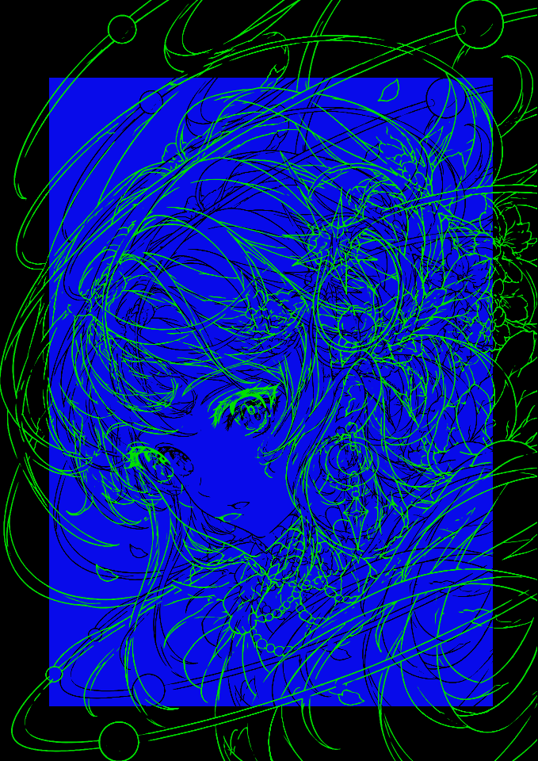
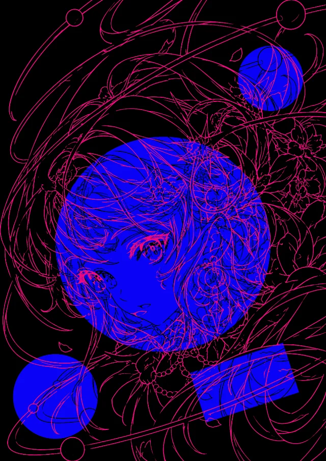
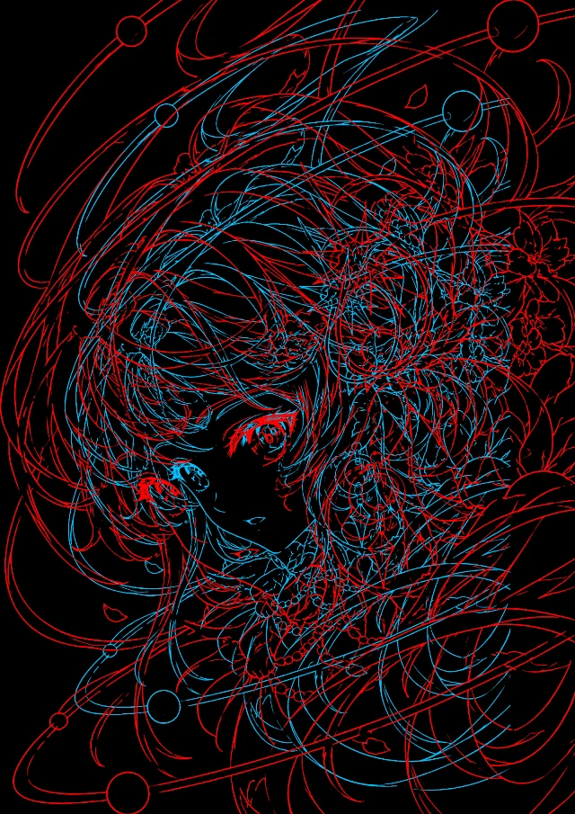
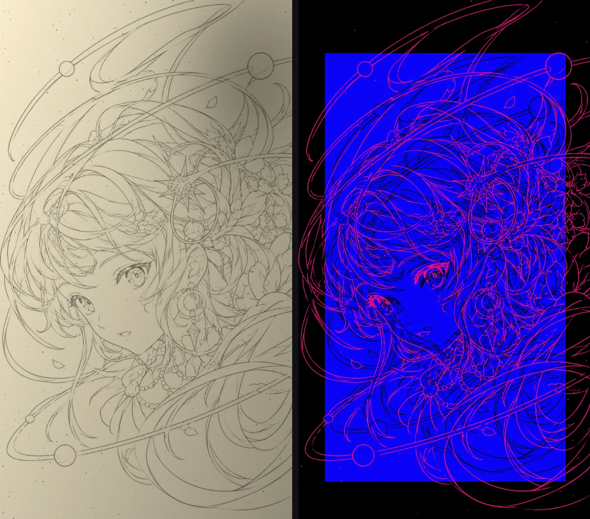
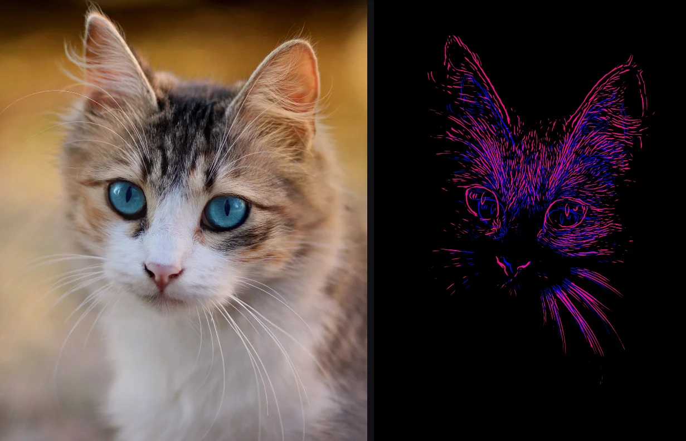

# Chromallax

[English](README.md) | 简体中文

**一张线稿，两层深度。** Chromallax 将同一张线稿叠成前后两层：较小的一层为深色，位于一块蓝色窗口之中；较大的一层为品红色，浮在前方，并延伸到窗口之外，使画面呈现出立体感。


**[在线使用](https://ocnos936.github.io/Chromallax/)**：直接在浏览器中运行，无需安装任何软件，支持导出 PNG、JPEG、WebP 图片和循环播放的 GIF 动图。

<table>
  <tr>
    <td></td>
    <td></td>
    <td></td>
  </tr>
  <tr>
    <td align="center">动态效果，导出为 GIF<br>绿配蓝</td>
    <td align="center">任意形状的窗口<br>白配蓝</td>
    <td align="center">无窗口<br>红配青</td>
  </tr>
</table>

## 快速开始

在 Chrome、Safari、Firefox 或 Edge 中打开 <https://ocnos936.github.io/Chromallax/> 即可使用。图片只在浏览器本地处理，不会上传。

如果想在自己的电脑上运行，需要 [Node.js](https://nodejs.org) 20 或更高版本。在项目文件夹中运行：

```bash
npm run dev
```

然后在浏览器中打开终端显示的地址，通常为 <http://localhost:5173>。无需 `npm install`，也无需构建。

<details>
<summary><b>初次使用终端的分步说明</b></summary>

1. **安装 Node.js**（仅需一次）：从 [nodejs.org](https://nodejs.org) 下载并安装 LTS 版本。安装完成后，可在终端中运行 `node -v` 确认，显示 `v22.11.0` 之类的版本号即表示安装成功。macOS 的终端即“终端”应用，位于“应用程序 → 实用工具”；Windows 请使用开始菜单中的 **PowerShell**。
2. **获取代码**：在 GitHub 页面点击 **Code → Download ZIP**，解压到任意位置；也可以使用 git 克隆仓库。
3. **在项目文件夹中打开终端：**
   - macOS：输入 `cd `（末尾带一个空格），将文件夹拖入终端窗口，然后按回车。
   - Windows：在文件资源管理器中打开该文件夹，点击地址栏，输入 `powershell` 后按回车。
4. **启动**：运行 `npm run dev`，然后在 Chrome、Safari、Firefox 或 Edge 中打开终端显示的 `http://localhost:…` 地址。使用期间请保持终端开启，它负责提供服务。
5. **停止**：在终端中按 **Ctrl + C**（macOS 同样使用 Ctrl，而非 Command）。仅关闭浏览器标签页并不会停止服务。

常见问题：

- *提示 5173 端口已被占用*：说明已有另一个实例在运行。服务器会自动改用下一个空闲端口并显示新地址，打开该地址即可。
- *页面始终停留在“Loading…”*：通常是因为直接双击打开了 `index.html`，这种方式无法运行。请使用 `npm run dev` 启动，再打开显示的地址。
- *提示找不到 `npm`*：说明尚未安装 Node.js，或终端是在安装之前打开的。安装完成后，请重新打开一个终端再试。

</details>

## 原理


画面由同一张线稿的两份副本组成，分处远近两个深度。**Ink**（墨线层）位于远处，是以 **焦点** 为中心缩小后的线稿；**Echo**（回声层）位于近处，保持原始大小，以品红色显示。两层在焦点处完全重合，越靠近边缘错开得越多，这正是物体离观者更近时所呈现的样子。蓝色的 **窗口** 由整张画布按相同比例缩小而来，Ink 位于其中，如同墙上悬挂的画。

配色同样有助于表现深度：在深色背景上，多数人会觉得红色比蓝色更靠前。

焦点宜放在希望保持不动的部位，通常是眼睛。

<br clear="right">

## 使用方法


点击 **Import** 导入线稿，也可以直接将图片拖入页面或粘贴。点击 **Demo** 可载入示例图。在工具栏中选择画布的比例和尺寸后：

- **Layers**（图层）：选择要在画面上调整的图层，可以是整幅图、Echo、Ink 或窗口。选中后，拖动可移动，滚轮或双指捏合可缩放。
- **Windows**（窗口）：可选。支持添加矩形和圆形窗口，拖动控制点即可缩放和旋转，操作方式与演示文稿软件中的图形一致。点击眼睛图标可隐藏全部窗口，只保留黑色背景上的线条。
- **深度**：即 Echo 一行中显示的数值，可左右拖动调整，也可点击后直接输入。
- **Colours**（配色）：预设配色都让偏红的颜色在前；Custom 格可以自己选色并保存。少数人看到的前后关系正好相反，可以用 *Swap near and far* 对调。
- **Motion**（动态）：让画面在几个视角之间切换，类似摇摆立体图（wigglegram），使远近层次更加明显。
- **Export**（导出）：静态画面可导出为 PNG、JPEG 或 WebP，动态效果可导出为 GIF。在 Chrome 和 Edge 中可以自行选择文件名和保存位置。

支持撤销和重做。画布、颜色和窗口等设置会自动保存，下次打开时恢复。

<details>
<summary><b>鼠标与快捷键</b></summary>

| 操作 | 功能 |
| --- | --- |
| 拖动，或按方向键（按住 Shift 时每次移动 10 px） | 移动所选图层 |
| 滚轮、双指捏合，或按 + / − | 缩放所选图层 |
| 拖动十字准星，或双击画面 | 移动焦点 |
| 拖动窗口控制点时按住 Shift | 保持长宽比 |
| 拖动窗口控制点时按住 Alt（Option） | 以中心为基准缩放 |
| 旋转窗口时按住 Shift | 以 15° 为步长旋转 |
| Delete 或 Backspace | 删除所选窗口 |
| Esc | 取消选择 |
| ⌘Z / ⇧⌘Z（Ctrl+Z / Ctrl+Y） | 撤销 / 重做 |

</details>

## 获得更好的效果

- **线稿**：粗细均匀的细线条立体感最强。大面积涂黑和过粗的笔画会削弱立体感，出现这种情况时，状态栏会给出提示。
- **不使用窗口时**，密集的排线和涂黑会呈现为成片的色块，更适合阴影较重的作品。
- **扫描件或手机拍摄的纸面线稿**：展开 **Line extraction**（线条提取），勾选 *Even out the paper's light*（均衡纸面光照），点击 *Auto*，再用 *Remove specks*（去除斑点）清理杂点。

  

- **照片**（实验功能）：将 **Line extraction** 切换为 *Photo*。适合背景简洁或经过虚化的照片，例如手机人像模式拍摄的照片。照片中的所有边缘都会转为线条，因此背景越复杂，线条也越杂乱。

  

## 开发

运行 `npm test` 可执行单元测试，测试基于 Node 内置的测试运行器。应用由原生 HTML、CSS 和 ES 模块构成，没有外部依赖，也无需构建。

<details>
<summary><b>代码结构</b></summary>

| 路径 | 作用 |
| --- | --- |
| `src/app.js` | 界面与分阶段渲染 |
| `src/config.js` | 默认值与取值范围 |
| `src/geometry.js` | 布局计算：画布、图像位置、深度、窗口、动态效果 |
| `src/preprocess.js` | 线条提取与线宽计算 |
| `src/photo.js` | 照片模式：沿照片中的边缘生成线条 |
| `src/render.js` | 图层绘制 |
| `src/colour.js` | 配色预设，以及颜色对深度的影响 |
| `src/gif.js` | GIF 编码 |
| `src/history.js`、`src/settings.js` | 撤销历史，以及跨会话保存的设置 |
| `tests/` | 单元测试，覆盖所有不依赖浏览器的模块 |
| `scripts/serve.mjs` | 本地服务器 |

</details>

## 致谢

- 示例线稿由 AI 生成，不受版权限制。
- 猫的照片为 AdinaVoicu 拍摄的 *Tabby cat with blue eyes*，来自 Wikimedia Commons，采用 [CC0](https://commons.wikimedia.org/wiki/File:Tabby_cat_with_blue_eyes-3336579.jpg) 许可。
- 铅笔“扫描件”为模拟图像：由示例线稿经程序调淡，并添加阴影和灰尘生成。

## 许可证

[MIT](LICENSE) © 2026 Ruiqiang Liu
